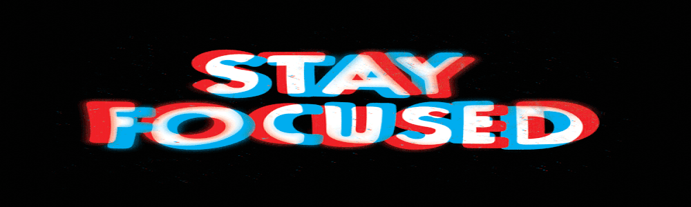
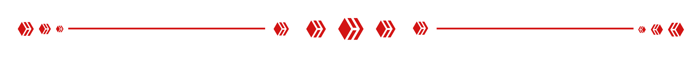

<h1 align="center">John Zachary N. Gillana</h1>
<h3 align="center">Computer Engineering Student | AI & Full-Stack Developer</h3>

  

 

  
     
  

 

<h2 align="center">Tech Stack</h2>

  <strong>Programming</strong>  
   &nbsp; &nbsp;
   &nbsp; &nbsp;
  
    
   &nbsp; &nbsp;
   &nbsp; &nbsp;
  
    
   &nbsp; &nbsp;
  
  
   

  <strong>Frontend & Mobile</strong>  
   &nbsp; &nbsp;
  
  
   

  <strong>Backend & AI</strong>  
   &nbsp; &nbsp;
   &nbsp; &nbsp;
  
    
   &nbsp; &nbsp;
   &nbsp; &nbsp;
  

<!-- 🚀 FEATURED PROJECTS SECTION -->
<h2 align="center">🚀 Featured Projects</h2>

### 🌱 [ONION: Your Personal PlantCare Companion](https://github.com/jzekken/ONION-Your-Personal-PlantCare-Companion.git)

<strong>OOP Project | Sole Developer</strong>

A smart application utilizing AI image recognition to identify plant species and track their overall health, providing users with an accessible tool to monitor and maintain optimal plant care.

### 💻 [MORT (My Online Resource Terminal)](https://github.com/jzekken/Mort.git)

<strong>Full-Stack Developer</strong>

A centralized digital hub for managing, organizing, and accessing essential online resources and tools. A comprehensive educational platform that extracts text from document uploads to create interactive study materials. It features AI-driven text summarization, custom quiz and flashcard generation, a contextual chatbot for querying notes, and an integrated calendar for task management.

### 🔍 [TuklaScope](https://github.com/jzekken/tuklascope_mobile.git)

<strong>Full-Stack Developer</strong>

A cross-platform mobile app that utilizes AI object recognition to help users explore and discover potential career paths based on their real-world environment and interests.

   &nbsp; &nbsp;
  

### ♟️ [ChessFPS](https://chessfps.vercel.app/)

<strong>Sole Developer</strong>

A chess game with FPS mechanics. You miss, you lose the piece.

<h2 align="center">Zach's Pitstop</h2>

  

